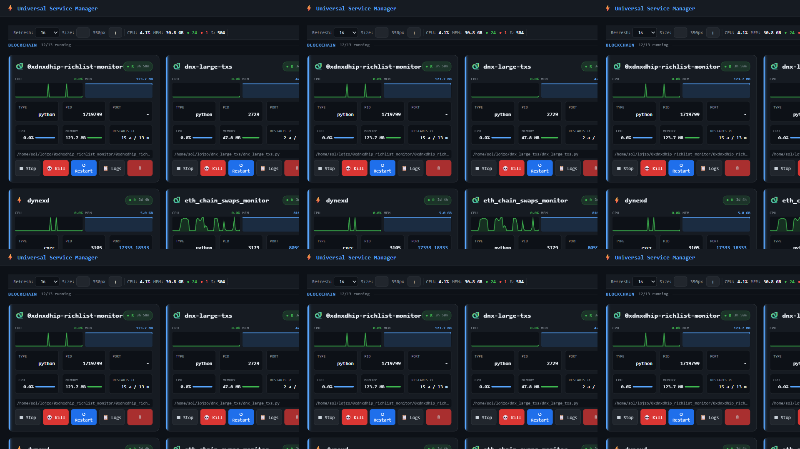
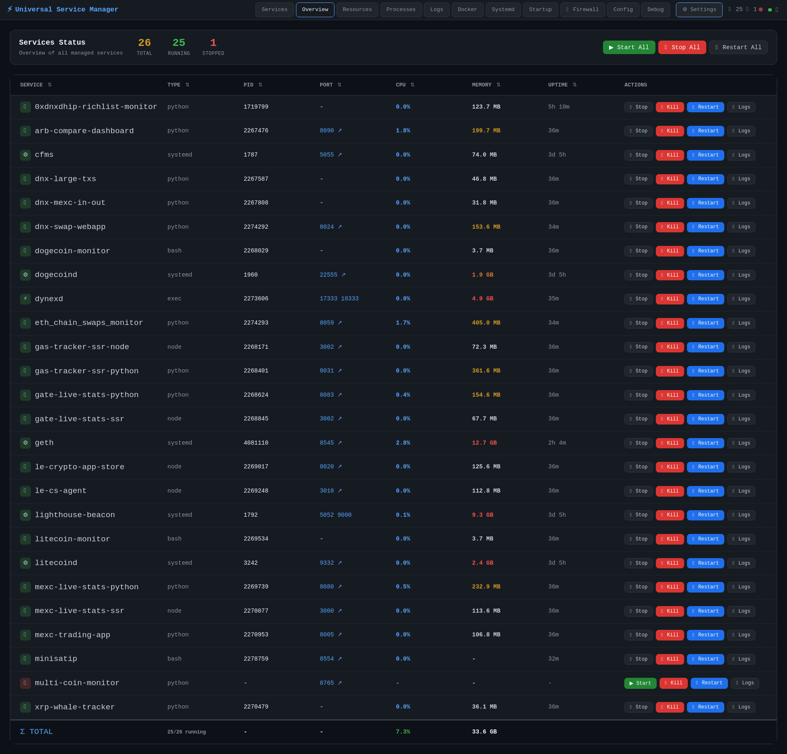
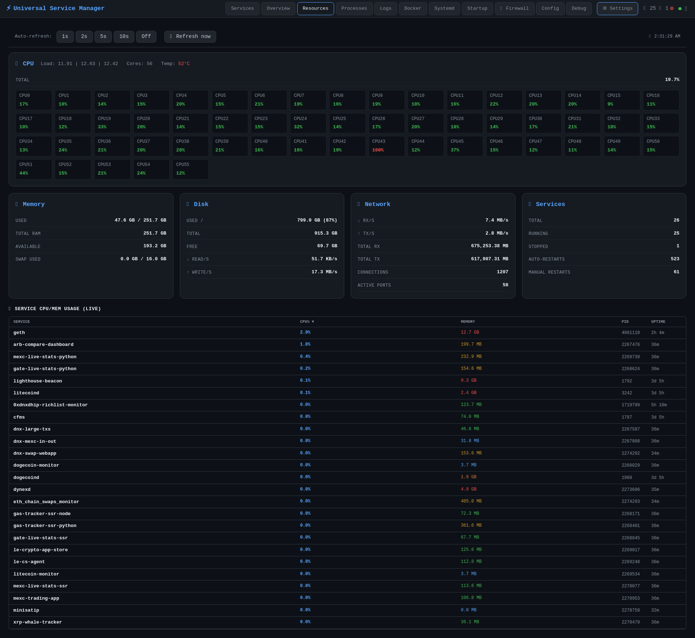
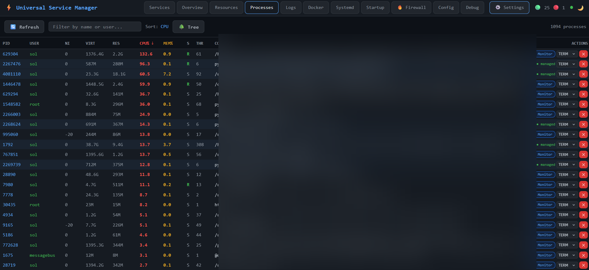
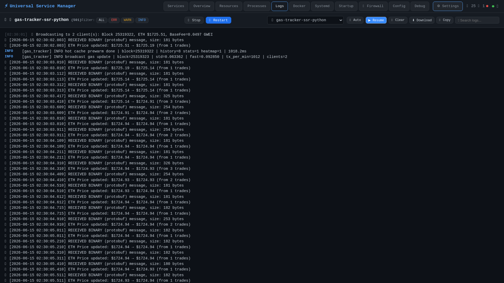
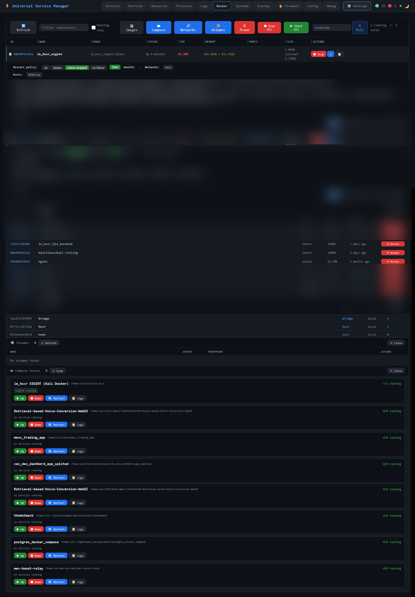
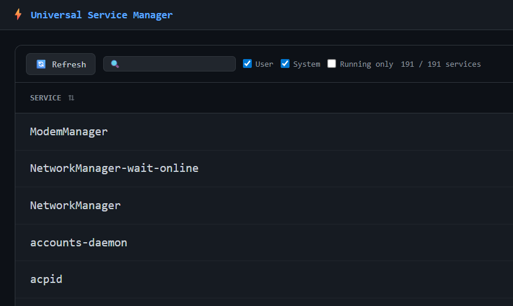
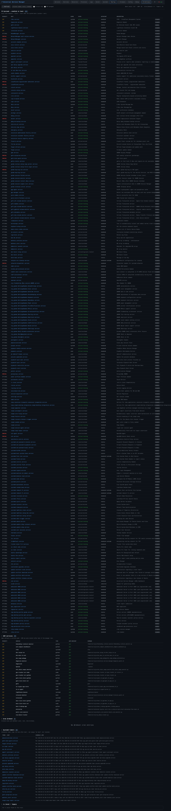
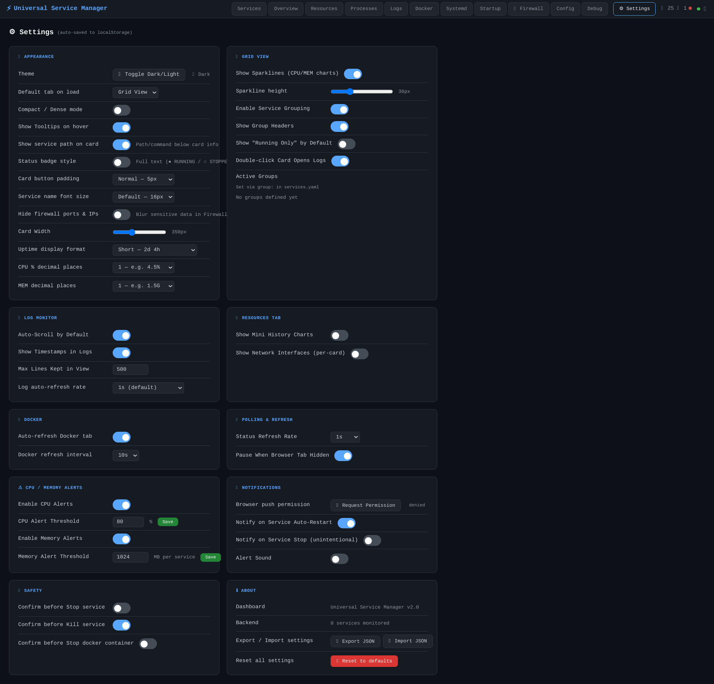

# Universal Service Manager (USM)

**Universal Service Manager** is a single-process Python control plane with a browser dashboard for operating a large mixed fleet on one Linux host — Python APIs, Node tools, bash watchers, native systemd units, and Docker containers — from one tabbed UI instead of juggling SSH sessions, `systemctl`, `docker`, and log paths. Operators declare the fleet once in `services.yaml`; USM handles start/stop/restart, auto-recovery after crashes, live CPU and memory metrics, log tailing, boot visibility, optional UFW firewall editing, and in-browser config saves.

The author built USM for a **mixed homelab/production box** where many custom apps coexist — trading dashboards, chain monitors, SSR nodes, Docker sidecars — and nothing off-the-shelf fit the whole picture. PM2 covers Node only; Portainer or Cockpit miss YAML fleet semantics, auto-restart policy, and the same log/metrics surface for bash and systemd entries. Rather than duct-taping four tools, USM is the **one daily operations UI** the author actually runs in development and on the server: when a port clashes, a watcher dies, or a compose stack needs a bounce, everything is one tab away.

Before a deploy, **Stop** the service (sets intentionally-stopped so USM does not auto-restart mid-upload); watch **Logs** with **ERR** filter until clean; **Restart** and confirm the card goes green. A stray Python worker appears in **Processes** → **+ Monitor** adds it to `services.yaml` without SSH nano. A Redis container misbehaves → **Docker** tab → **Restart** + inline logs, while the FastAPI entry restarts from **Services**. Host feels slow → **Resources** → sort the bottom table by CPU% and kill the hog from **Processes**.

## Tech stack

| Layer | Technologies |
|-------|--------------|
| Control plane | Python 3, `ThreadingHTTPServer`, `BaseHTTPRequestHandler`, background worker thread |
| Serialization | `orjson` (fallback `json`), PyYAML |
| Host metrics | `psutil` — CPU, memory, disk I/O, network, process list, temperatures |
| Dashboard | Single-page `dashboard.html` — HTML, CSS, vanilla JavaScript (12 tabs) |
| Service types | `python`, `node`, `bash`, `systemd`, `exec` — venv paths, env files, optional `depends_on`, `group` |
| Containers | Docker CLI — `ps`, `stats`, `logs`, `exec`, `pull`, prune; Compose `up`/`down`/`build`/`pull`/`restart`/`logs` |
| Host integration | systemd (system + user scope), UFW firewall, cron `@reboot` inspection |
| State on disk | `services.yaml`, `~/.service_manager/state.json`, PID files, per-service log files |
| Realtime | Server-Sent Events (`/api/stream`) for status, system, process, and event pushes |
| Auth | Optional `dashboard_password` in YAML or `USM_PASSWORD` env — Bearer token + HttpOnly cookie |
| Hosting | Self-hosted Linux server |

## Control plane and reliability

USM runs as one Python process: a **background worker thread** pre-computes expensive data so HTTP handlers return cached snapshots in under a millisecond instead of blocking on `systemctl` or `psutil` per browser poll. The worker refreshes **service status** about every second (batch `systemctl is-active` for systemd-backed entries, PID checks for process types), **system stats** every two seconds, the **process list** every three seconds, and an **auto-restart monitor** every five seconds.

When a service with `auto_restart: true` drops while the dashboard is up, USM attempts a restart and records an `auto_restart` event. YAML can cap recovery with `max_restarts` and delay with `restart_delay` seconds between attempts. **Manual Stop or Kill** sets an `intentionally_stopped` flag in persisted state so auto-restart does not fight the operator; **Start or Restart** clears that flag. Restart counters are split: **auto** restarts vs **manual** restarts, shown on cards as `auto / man`. Cards also surface an intentionally-stopped badge when the operator halted a service on purpose.

Sparkline history (~60 samples per service) feeds CPU and memory mini-charts on the grid. Connected browsers can subscribe to **SSE** for live status, system, process, and debug-event updates. The **Page Visibility API** pauses polling when the tab is hidden (configurable); the **window title** shows running/stopped counts so you can glance at fleet health from the taskbar. Press **`?`** for keyboard shortcuts — number keys `1`–`9` and `0` jump between major tabs; **`p`** pauses polling, **`R`** forces refresh.

The same binary exposes a **CLI** (`start`, `stop`, `restart`, `status`, `logs`, `list`, `reload`, `edit`, `monitor`, `dashboard`) for scripting and headless use alongside the web UI.

## Services grid

The **Services** tab is the default home screen and the visual command center for the YAML fleet. A toolbar shows host-level CPU and memory summaries, running/stopped counts, and total restart activity, plus global refresh rate (0.5s–10s), card width zoom (−/+ or Settings slider), text filter, group dropdown, and a **running-only** checkbox.

Each **group** (from `group:` in YAML) renders a collapsible section with **Start All / Stop All / Restart All** for that group. Service **cards** use a green or red border for running vs stopped, show type, PID, declared or detected listening **port** (clickable localhost link), CPU% and memory with inline progress bars, combined restart counts, and optional **Depends On** chips that turn green or red based on whether named dependencies are up. Dual **sparklines** plot recent CPU and memory; hover actions expose Start, Stop, Kill, Restart, and Logs without opening another tab. Cards reorder via drag handle (⋮⋮ only — not the whole card); order persists in **localStorage**. Double-click a card (when enabled in Settings) jumps straight to the Logs tab for that service.

Toolbar actions include **▶ All**, **⏹ All**, **↺ Stopped** (restart only stopped entries), force refresh, collapse/expand all groups, and **＋ Add** to open the add-service modal (name, type, command, working dir, port, group, auto-restart) which writes a new block into `services.yaml` and reloads the fleet.

Per-card buttons are **Start**, **Stop**, **Kill** (force terminate), **Restart**, and **Logs**. Stop sets the intentionally-stopped flag; Kill does the same with SIGKILL semantics. Port links open `http://localhost:<port>` in a new tab when a listener is detected even if `port:` was omitted in YAML. Group headers expose the same bulk start/stop/restart trio for that section only.

When a `python` API card shows rising auto-restart count → open **Logs** from the card, fix the crash, hit **Restart**; if you need the process down during maintenance, **Stop** (not Kill) so auto-restart stays off until you **Start** again.

## Overview table

The **Overview** tab is the spreadsheet view of the same managed services — better for scanning long fleets, sorting by resource usage, or copying exact service names into tickets. A header row shows total, running, and stopped counts with the same **Start All / Stop All / Restart All** bulk actions as the grid.

The table columns are **Service**, **Type**, **PID**, **Port**, **CPU**, **Memory**, and **Uptime** — each sortable via column header click. Row actions provide Start, Stop, Kill, Restart, and Logs without leaving the table. Use this tab when you need a dense list rather than card layout, or when comparing CPU and memory across dozens of entries at once.

## System resources

The **Resources** tab answers whether the **host** is healthy, not just whether individual apps respond. A per-tab auto-refresh selector (1s / 2s / 5s / 10s / Off) and **Refresh now** control sit above the layout; a last-updated timestamp confirms data freshness.

The top **CPU** panel spans full width: total utilization, 1/5/15 load averages, core count, temperature when the OS exposes it, and a **per-core mini-bar grid** for every logical CPU. Optional mini history charts (toggle in Settings) plot CPU, memory, disk I/O, and network RX over recent samples.

Four cards below cover **Memory** (used, total, available, swap), **Disk** (root usage, free space, read/write rates per second, extra mount points when present), **Network** (RX/TX rates, cumulative totals, TCP connection count, active listening ports, per-interface breakdown when enabled), and **Services** (managed running/stopped totals plus fleet-wide auto and manual restart counts).

A **Service CPU/MEM Usage** table at the bottom ranks managed services by live CPU%, memory, PID, and uptime — sortable columns for spotting hot processes during incidents.

## Processes

The **Processes** tab is a browser-side **htop** over the whole machine, fed from the background cache so refreshes stay non-blocking. Columns include **PID**, **USER**, **NI**, **VIRT**, **RES**, **CPU%**, **MEM%**, process **state** (R/S/D/Z), **thread count**, and full **command line**. Click any header to sort; type in the filter box to narrow by process name or user. Toggle **🌳 Tree** for a parent/child process tree view.

Rows belonging to USM-managed services are **highlighted**. Unmanaged processes expose **+ Monitor**, which opens the add-service modal pre-filled from the running command so you can adopt a stray process into `services.yaml` without hand-editing blind. A separate **Kill** action on arbitrary PIDs is available for one-off cleanup (with confirmation when enabled).

To find a rogue process, sort by **CPU%** and spot an unknown `python3` hogging a core → read PID, click **+ Monitor**, name it, save — it appears on the Services grid next boot with auto-restart policy.

## Log monitor

The **Logs** tab replaces SSH `tail -f` for fleet triage. Pick any managed service from the dropdown; the view streams the service log file (or systemd journal where applicable) with color-coded levels — **ERROR** red, **WARN** yellow, **INFO** blue, **DEBUG** grey. Level filter buttons (**ALL / ERR / WARN / INFO**) hide noise during incidents.

While watching logs you can **Start**, **Stop**, or **Restart** the selected service from the toolbar. **Auto-scroll** follows new lines; **Pause** freezes the buffer for reading; **Clear** wipes the on-screen view without touching the file. **Download** saves the log; **Copy** puts visible lines on the clipboard. A search box highlights matching text in the buffer. Log refresh rate, max lines kept, timestamp display, and default auto-scroll are configurable under Settings.

After a deploy, pick the service from the dropdown, set filter to **ERR**, pause auto-scroll when you find the stack trace, fix config in the **Config** tab, **Restart** from the log toolbar, switch filter to **ALL** to watch a clean boot line.

## Docker

The **Docker** tab manages containers alongside YAML-defined processes — useful when part of the stack runs in Docker without a USM service entry. The toolbar refreshes the container list, filters by name/image, supports **running only**, and shows running/total counts.

The main table columns are **ID**, **Name**, **Image**, **Status**, live **CPU%** and **Memory** from `docker stats`, **port mappings**, **size**, and per-row **Start / Stop / Restart**. Resizable columns help on wide screens. Batch **Stop All** and **Start All** act on the filtered set. **Pull** accepts an `image:tag` to fetch new images.

Sub-panels open from the toolbar:

- **Images** — browse local images, refresh, delete unused tags
- **Compose** — discover `docker-compose.yml` / `compose.yaml` files, run **up**, **down**, **build**, **pull**, **restart**, and tail compose logs
- **Networks** and **Volumes** — inspect and remove unused resources
- **Prune** — remove stopped containers

An inline log panel streams `docker logs` with timestamps for the selected container. **Exec** runs a command inside a running container from the UI. Docker auto-refresh interval is configurable (5s–60s). When the Docker daemon is unreachable, the tab shows a clear error instead of a blank table.

API container healthy but cache sidecar stale → filter containers, open inline logs on the Redis/nginx container, **Restart** it, then confirm port mapping in the expanded row. A compose project failed → **Compose** sub-panel → **Up** on the stack, **Logs** tail until all services report running.

## Systemd

The **Systemd** tab lists native **system** and **user** units with filters for scope, text search, and **running only**. Columns cover unit name, active state, sub-state, **autostart** (enabled/disabled), description, and actions: **Start**, **Stop**, **Restart**, **Enable/Disable** autostart, **📝 Journal**, and **+ Monitor** to import an unmonitored unit into `services.yaml` as a `systemd`-type USM entry.

Selecting **Journal** opens a bottom panel with configurable line count (50–500), refresh, and close — `journalctl` output without leaving the dashboard. Managed units already in USM are marked so you do not duplicate entries.

## Startup

The **Startup** tab maps **what runs at boot** across several mechanisms — valuable before maintenance windows or when onboarding a new daemon. Refresh reloads all sections; text filter and **Crucial only** / **USM managed** checkboxes narrow the view.

Sections include:

- **Systemd — enabled at boot** — units with `enabled` or `static` autostart (system + user), with enable/disable actions
- **USM services** — entries from `services.yaml` and whether `auto_restart` will bring them back after the manager starts
- **Cron @reboot** — lines from user crontab, root crontab, and `/etc/crontab`
- **Systemd timers** — scheduled timers that may fire soon after boot
- **rc.local / legacy** — preview of classic boot scripts when present

## Firewall

The **Firewall** tab edits **UFW** from the browser when UFW is installed. If missing, an install prompt can run `apt-get install ufw` from the UI. The status bar shows whether the firewall is active, a master **Enabled** toggle, default **incoming/outgoing** policies (allow/deny), and actions to add, edit, delete, reorder, or **reset all** rules (with confirmation).

The rules table lists action (ALLOW/DENY), port/protocol, source, and direction. **Add Rule** supports port or application profile, TCP/UDP/both, source CIDR or `Anywhere`, and comment text; rules can be **moved up/down** in the chain before commit. A **Firewall Log** panel streams recent UFW deny/block lines for quick triage. Settings can **blur sensitive ports and IPs** when demonstrating the dashboard remotely — useful for screen shares without exposing internal network detail.

## Config editor

The **Config** tab is a full-height **YAML editor** for `services.yaml`. Toolbar shows the active file path and line count. **Reload** discards unsaved edits and re-reads disk; **Validate** checks YAML structure and confirms a top-level `services` map; **Save & Apply** writes the file and reloads the in-memory fleet without restarting the USM process. Validation and save errors surface inline above the editor. Use this when adding `auto_restart`, `restart_delay`, `max_restarts`, `depends_on`, `group`, `env_file`, or `user_service` flags — then confirm behaviour on the Services grid.

## Debug and events

The **Debug** tab supports post-mortems after deploys or auto-restart storms. Four summary panels at the top show **service health** (stopped and high-restart entries), **active alerts** (CPU/memory threshold breaches from Settings), **dashboard info** (version, uptime, cache ages), and **restart leaders** (services with the highest auto-restart counts).

Below, an **Event Log** ring buffer (up to 10,000 entries) lists every start, stop, kill, restart, auto-restart, config save, firewall change, and docker action with timestamp, success/fail, duration in milliseconds, and expandable stderr for failures. **Refresh** pulls the latest; **Clear** wipes the in-memory buffer. Events also push over SSE when the tab is open.

## Settings

The **Settings** tab controls dashboard UX; every toggle auto-saves to **localStorage** and can be **exported/imported as JSON** or reset to factory defaults.

| Section | What you configure |
|---------|-------------------|
| Appearance | Dark/light theme, default tab on load, compact mode, tooltips, service path on cards, full vs short status badges, card button padding, title font size, firewall privacy blur, card width slider, uptime format, CPU/MEM decimal places |
| Grid View | Sparklines on/off and height, grouping and group headers, running-only default, double-click-opens-logs, active group list |
| Log Monitor | Default auto-scroll, timestamps, max lines in view, poll rate (200ms–5s) |
| Resources | Mini history charts, per-network-interface cards |
| Docker | Auto-refresh on/off, interval (5s–60s) |
| Polling | Global status refresh (0.5s–10s), pause when browser tab hidden |
| Alerts | CPU and per-service memory thresholds with enable toggles |
| Notifications | Browser push permission, notify on auto-restart or unintentional stop, optional alert sound |
| Safety | Confirm dialogs before stop, kill, or docker stop |

## Managed service types

| Type | Typical use |
|------|-------------|
| `python` | FastAPI, Flask, or scripts via `python3` and optional venv path in `command` |
| `node` | Node SSR, bundlers, or tooling via `node` |
| `bash` | Watchers, chain monitors, glue scripts |
| `systemd` | Proxy control for existing units (`command` = unit name; `user_service` for `--user` scope) |
| `exec` | Arbitrary command lines split into argv |

Docker workloads are operated from the Docker tab even when not declared as YAML services. YAML fields such as `port`, `working_dir`, `args`, `env_file`, `group`, `depends_on`, `auto_restart`, `restart_delay`, and `max_restarts` tune how each entry starts and recovers.

A top-level `settings:` block in `services.yaml` can set `dashboard_port`, `dashboard_password`, and `log_retention_days` without editing Python. Optional password protection shows a login modal; successful login issues a session token (Bearer header or HttpOnly cookie) required for all write routes and the dashboard HTML itself.

USM targets **mixed Linux fleets** — broader than a Node-only manager. See [FEATURES.md](FEATURES.md) and [VS_PM2.md](VS_PM2.md) for extended comparison notes.

## CLI (headless operations)

The `usm.py` entrypoint mirrors dashboard actions for scripts and SSH-only sessions:

| Command | Behaviour |
|---------|-----------|
| `dashboard [port]` | Start the web UI (default port from YAML or built-in default) |
| `start <name\|all>` | Start one service or entire fleet |
| `stop <name\|all> [--force]` | Graceful stop or force kill |
| `restart <name\|all>` | Stop then start |
| `status [name]` | Print running/stopped table |
| `logs <name> [-f] [-n lines]` | Tail file log (`-f` follow) |
| `list` | Enumerate configured services and types |
| `reload` | Re-read `services.yaml` without restart |
| `edit` | Open config in `$EDITOR` |
| `monitor` | Terminal watch mode |

Private code: [universal-service-manager](https://github.com/logicencoder/universal-service-manager)

See [REPOS.md](REPOS.md).

---

**Made by [Logic Encoder](https://logicencoder.com)** · [GitHub](https://github.com/logicencoder) · [Contact](https://logicencoder.com/contact/)
