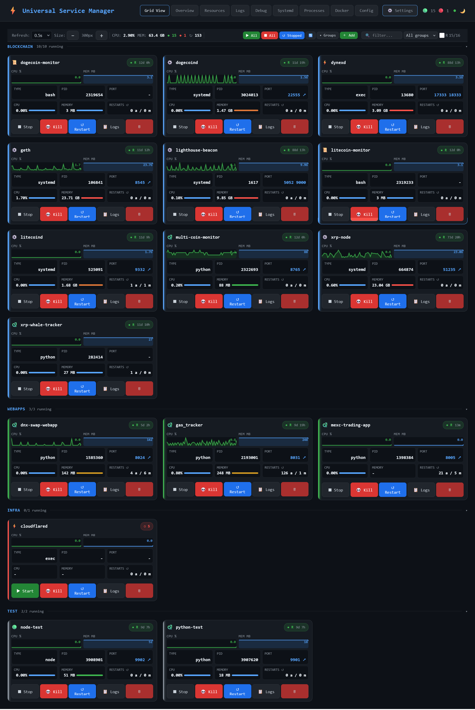
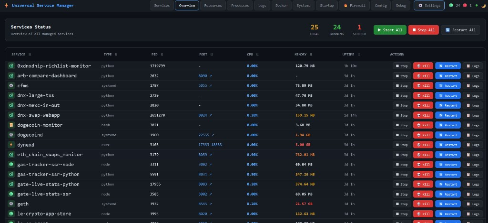
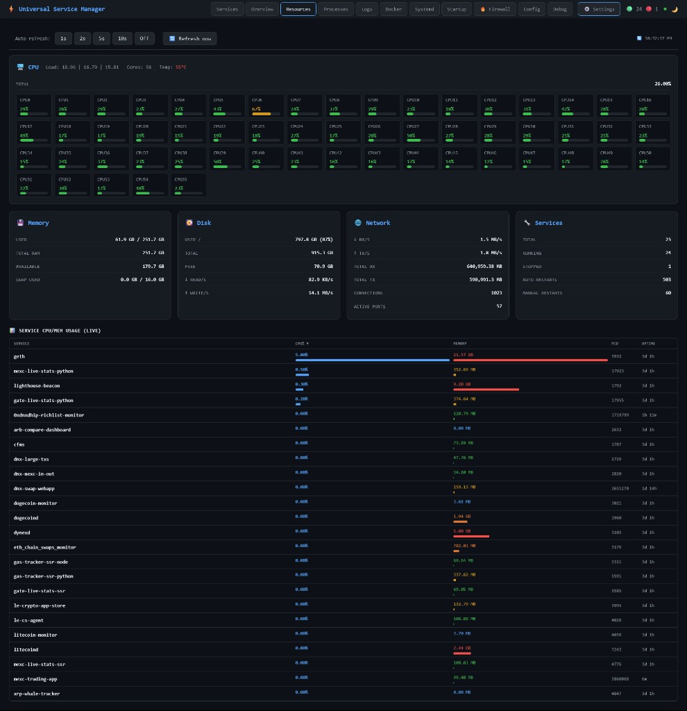
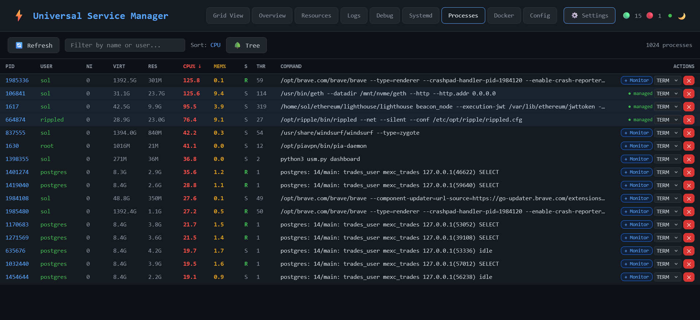
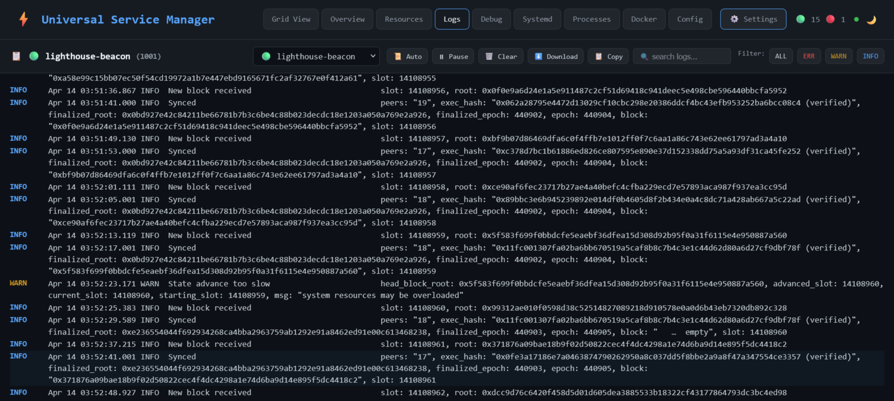
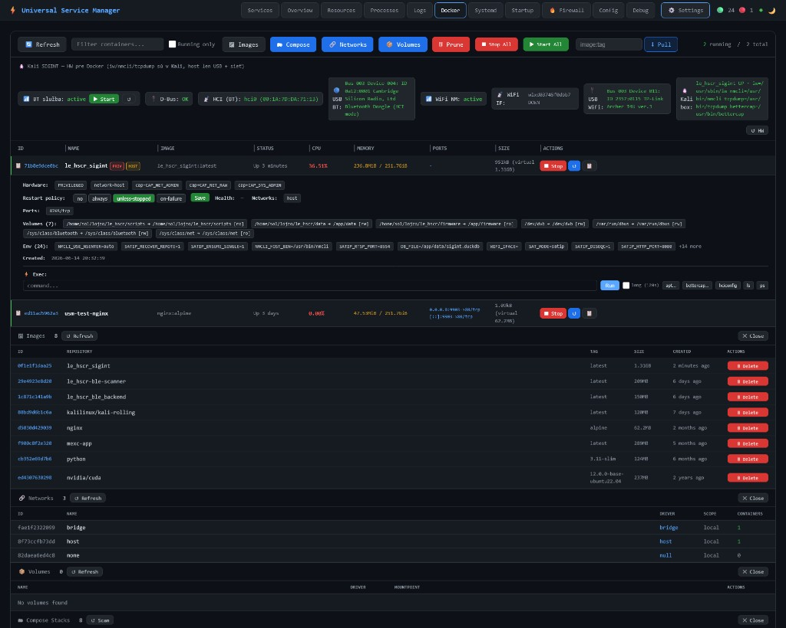
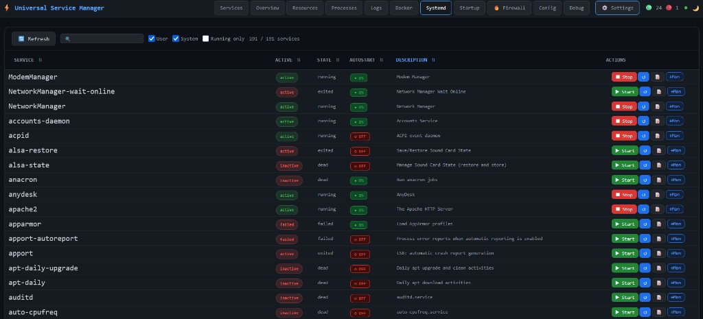
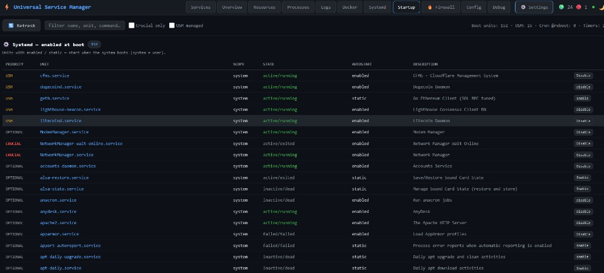
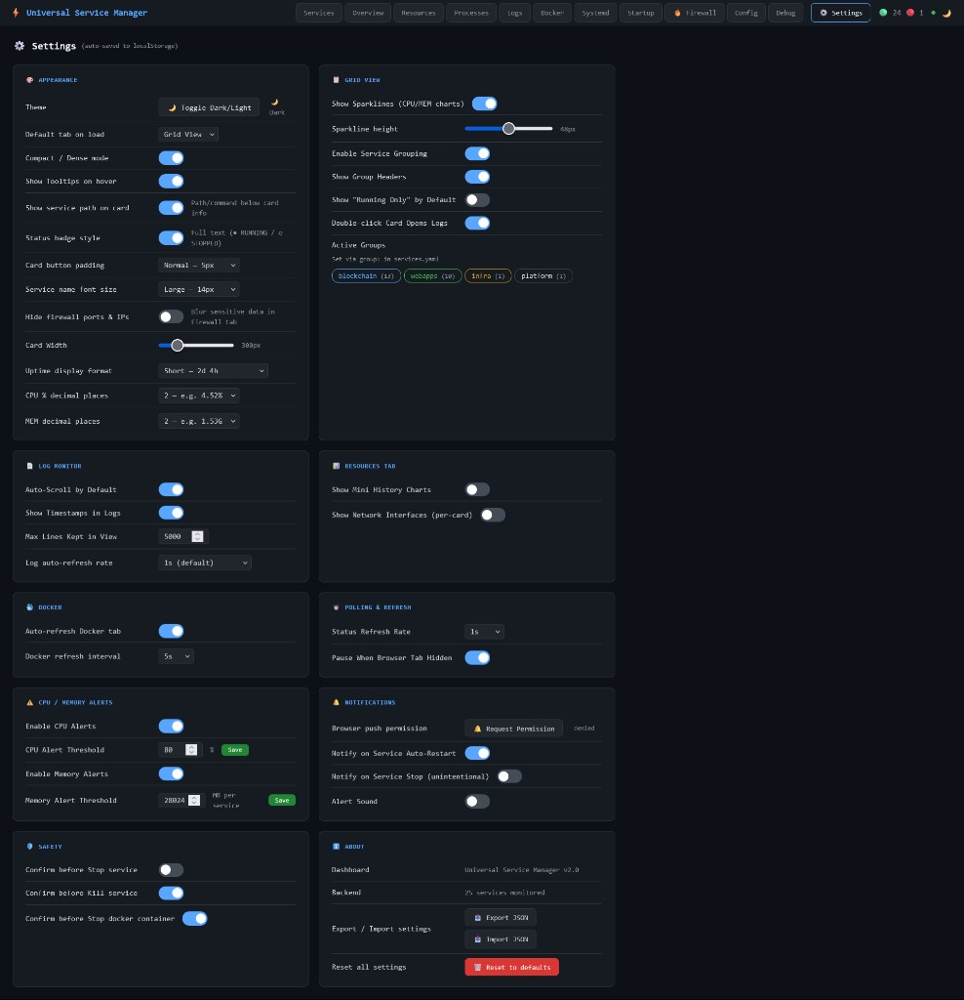

# Universal Service Manager (USM)

**Universal Service Manager** is a single-process Python control plane with a browser dashboard for running a large fleet of services on one Linux host — start/stop/restart, auto-recovery, live metrics, log tail, systemd control, Docker/Compose, firewall editing, and in-browser config editing without juggling SSH sessions.

Private source: [logicencoder/universal-service-manager](https://github.com/logicencoder/universal-service-manager). Service definitions live in `services.yaml` in the private repo — not in this overview.

## The problem it solves

Homelab and production operators often run dozens of long-lived processes: Python APIs, Node helpers, bash watchers, systemd units, and Docker stacks. Without a control plane you memorize working directories, virtualenvs, ports, and log paths — and crashed processes stay down until someone logs in remotely.

USM centralizes lifecycle, monitoring, and housekeeping behind one **authenticated web UI** (default port **5566**). You declare what to run once in YAML; the dashboard becomes the daily operations surface for the whole machine.

## Services grid

The **Services** tab is the main view: grouped cards for every managed entry in `services.yaml`. Each card shows running/stopped state, CPU and memory sparklines, PID, listening port, auto vs manual restart counts, and an intentionally-stopped badge when an operator halted a service on purpose so auto-restart does not fight them.

Cards support drag-and-drop reordering (persisted in the browser), adjustable card width for dense or sparse layouts, and bulk **Start All / Stop All / Restart All** for the visible group. Per-card actions include stop, kill, restart, and jump straight to logs. Group headers (for example blockchain daemons vs web apps) keep large fleets readable at a glance.

## Overview table

The **Overview** tab is the spreadsheet view of the same fleet: sortable columns for service name, type, PID, port, CPU%, memory, uptime, and row-level start/stop/restart/logs. Use it when you need to scan by resource usage, copy exact service names into tickets, or work through a long list faster than scrolling cards.

## System resources

The **Resources** tab answers “is the box healthy?” — not just “is one app up?”. Aggregate CPU with per-core bars, load averages, temperature where available, memory and swap, root disk usage with I/O rates, network RX/TX throughput, connection counts, active ports, and a live ranking of which managed services consume the most CPU and RAM.

Sparkline history (~60 samples) updates from a background worker so the UI stays responsive when multiple browser tabs are open. Refresh rate is configurable per tab (1s / 2s / 5s / 10s / off).

## Processes

The **Processes** tab is a browser-side **htop**: PID, user, CPU%, memory, state, thread count, and full command line with text filter and column sort. Processes that belong to USM-managed services are highlighted; unmanaged PIDs can be added to monitoring with **+ Monitor** so they join the fleet without hand-editing YAML blind.

## Log monitor

The **Logs** tab replaces SSH `tail -f`. Pick any managed service from a dropdown, stream file logs or systemd journal output, filter by level (all / error / warn / info), search within the buffer, pause auto-scroll, clear the view, copy, or download. Color-coded lines make incident triage faster when a deploy goes wrong at 2 a.m.

## Docker

The **Docker** tab covers containers outside (or alongside) YAML-managed processes: running/stopped status, image, CPU and memory from `docker stats`, port mappings, size, and per-container start/stop/restart. Inspect images, networks, volumes, and compose stacks; pull new images; run exec commands inside a container; prune unused resources — all from the same session where you restart your Python APIs.

## Systemd

The **Systemd** tab lists system and user units with active state, autostart enable/disable, start/stop/restart, and journal access. Filter by name, scope, or running-only. **+ Monitor** imports an existing unit into USM’s managed set so it appears on the Services grid with the rest of the fleet.

## Startup

The **Startup** tab shows what runs at boot: units with enabled or static autostart, tagged by priority (USM-managed, crucial, optional). Enable or disable boot behavior without memorizing `systemctl` syntax — useful before maintenance windows or when onboarding a new daemon.

## Firewall

The **Firewall** tab edits **UFW** rules in the browser: enable/disable the firewall, set default policies, add/edit/delete/reorder allow/deny rules, filter the table, and read recent deny log lines. Optional privacy blur hides sensitive ports and IPs when demonstrating the dashboard remotely.

## Config and debug

The **Config** tab validates and saves `services.yaml` in-browser — add or fix service blocks, toggle auto-restart, and reload the fleet without a separate editor session. The **Debug** tab exposes a ring buffer of recent start/stop/restart/kill events with timings for post-mortems.

## Settings

The **Settings** tab controls dashboard UX: theme, default tab on load, card density and font size, sparkline height, polling intervals, CPU/memory alert thresholds, log monitor defaults, Docker auto-refresh, confirmation prompts before destructive actions, browser notifications on auto-restart, and export/import of preferences as JSON.

## Managed service types

| Type | Typical use |
|------|-------------|
| `python` | FastAPI/Flask apps with venv commands |
| `node` | Node SSR or tooling processes |
| `bash` | Watchers and glue scripts |
| `systemd` | Proxy control for native units |
| `exec` | Generic command lines |

Dependencies (`depends_on`), auto-restart backoff, and manual-stop respect are configured per entry in YAML. Docker workloads can live in the Docker tab even when not declared as YAML services.

## Authentication

When a dashboard password is configured, login issues a session token and all write API routes require Bearer auth or a session cookie. Without a password the API is open on the bound interface — typical deployments place USM behind VPN or reverse-proxy TLS only.

## Evaluation

```bash
git clone https://github.com/logicencoder/universal-service-manager  # private — access required
pip install psutil pyyaml
cp services.yaml.example services.yaml
python3 usm.py dashboard 5566
```

USM is **not** a Node-only process manager like PM2. It targets **mixed Linux fleets**: systemd, Docker, Python, Node, and bash in one UI with host metrics and firewall editing in the same tool. See [FEATURES.md](FEATURES.md) and [VS_PM2.md](VS_PM2.md) in this repo for depth.

## Screenshots

### Services (main view)

Grouped service cards with CPU/MEM sparklines, ports, restart counts, and per-card start/stop/restart/logs.



### Overview

Dense table of all managed services with CPU, memory, uptime, and row actions.



### Resources

Host CPU (per-core), memory, disk I/O, network, and live service CPU/MEM ranking.



### Processes

htop-like process list with filter, sort, and **+ Monitor** for unmanaged PIDs.



### Logs

Live log tail with service selector, level filters, search, pause, and download.



### Docker

Containers, images, networks, volumes, compose stacks, and in-container exec.



### Systemd

Full systemd unit list with autostart toggles, start/stop/restart, and journal access.



### Startup

Boot-enabled units with USM / crucial / optional priority and enable/disable at boot.



### Settings

Dashboard appearance, polling, alerts, log monitor, Docker refresh, and export/import.



See [REPOS.md](REPOS.md).

---

**Made by [Logic Encoder](https://logicencoder.com)** · [GitHub](https://github.com/logicencoder) · [Contact](https://logicencoder.com/contact/)
